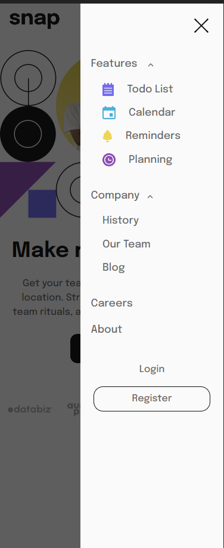

# Frontend Mentor - Solution pour la section d'introduction avec navigation descendante

Ceci est une solution au défi [Intro section with dropdown navigation on Frontend Mentor] (https://www.frontendmentor.io/challenges/intro-section-with-dropdown-navigation-ryaPetHE5). Les défis de Frontend Mentor vous aident à améliorer vos compétences en codage en réalisant des projets réalistes. 

## Table des matières

- Aperçu](#overview)
  - Le défi](#Le défi)
  - Capture d'écran](#Capture d'écran)
  - Liens](#liens)
- Mon processus](#mon-processus)
  - Construit avec](#Réaliser avec)
  - Ce que j'ai appris](#what-i-learned)
  - Développement continu](#continued-development)
  - Ressources utiles](#ressourcesutiles)
- Auteur](#auteur)
- Remerciements](#remerciements)

**Note : Supprimez cette note et mettez à jour la table des matières en fonction des sections que vous conservez.**

## Aperçu

### Le défi

Les utilisateurs doivent être en mesure de :

- Afficher les menus déroulants pertinents sur desktop et mobile lorsqu'ils interagissent avec les liens de navigation.
- visualiser la disposition optimale du contenu en fonction de la taille de l'écran de leur appareil
- voir les états de survol de tous les éléments interactifs de la page.

### Liens

- URL de la solution : [https://github.com/Al3sandre/Menu_dropdown_01] (Repos Github)
- URL du site réel : [Ajouter l'URL du site réel ici](https://your-live-site-url.com)

## Mon processus

### Construit avec

- HTML5
- SASS 
- FlexBox
- Parcel
- Vue.js

### Ce que j'ai appris

Reprise en main de vue.js par les bases, et pratique de SASS. 

